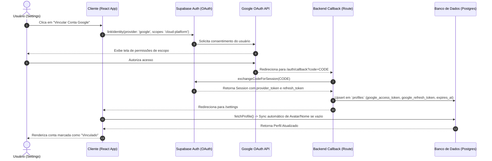

# Flow Trace: Ajustes (Settings & Profile)

## 📊 Visão Geral do Fluxo
- **Páginas Afetadas:** 
  - [`src/app/settings/page.tsx`](file:///d:/APPS%20-%20ANTIGRAVITY/G-Finance/src/app/settings/page.tsx) (Painel principal de Ajustes)
  - [`src/app/auth/page.tsx`](file:///d:/APPS%20-%20ANTIGRAVITY/G-Finance/src/app/auth/page.tsx) (Tela de autenticação e Lockscreen do PIN)
  - [`src/app/auth/callback/route.ts`](file:///d:/APPS%20-%20ANTIGRAVITY/G-Finance/src/app/auth/callback/route.ts) (Endpoint de resolução OAuth e persistência de credenciais em nuvem)
  - [`src/lib/crypto.ts`](file:///d:/APPS%20-%20ANTIGRAVITY/G-Finance/src/lib/crypto.ts) (Módulo de cifragem de segredos local)
- **Personas Analisadas:** First-Time User vs. Steady-State User
- **Eixo Primário:** **Cognitive Clarity** | **Eixo Secundário:** **Resilience & Recovery**

---

## 🗺️ Tabela Comparativa (Ideal vs Real)

| Step | Persona | Fluxo Ideal (Design Spec) | Fluxo Real (Empírico) | Div. | Confiança | Drop-off / Friction Point |
|:---:| :--- | :--- | :--- |:---:| :--- | :--- |
| **1** | First-Time | Acessa `/settings` e vê o perfil inicial preenchido com dados sincronizados do banco ou placeholders sofisticados. | Busca dados em `profiles` e se não encontrar preenche com metadados do login social do Google. Se nada existir, aplica fallback amigável. | `=` | Verified | Nenhuma fricção inicial. |
| **2** | First-Time | Altera a imagem do perfil (limite de 2MB) enviando um arquivo e vê um indicador de progresso ativo. | Carrega imagem localmente convertida em Base64 e exige clique explícito em "Salvar Alterações" para persistir no Supabase. | `~` | Verified | O usuário pode achar que a foto já foi salva no instante do upload, abandonando a página sem clicar em "Salvar". |
| **3** | First-Time | Clica em "Vincular Conta Google" para fundir a identidade social e obter os tokens do Google Cloud do Gemini. | Direciona para o OAuth do Supabase, passa pelas scopes do Google Cloud Platform e salva os tokens no banco em `/auth/callback`. | `=` | Verified | A tela de consentimento pode assustar usuários que esperam apenas login social comum devido à permissão da API Cloud Platform. |
| **4** | First-Time | Configura o PIN de 4 dígitos digitando-o duas vezes e inserindo a senha local para criptografar. | Solicita PIN, exige redigitação da senha e faz sign-in redundante para verificar a senha. Cifra a senha no local storage e salva o PIN em nuvem. | `!=` | Verified | **[BLOCKER]** Se o usuário realizou cadastro social (Google/GitHub), ele não tem senha local. A tentativa de criar o PIN falha de forma silenciosa ou ruidosa no sign-in. |
| **5** | Steady-State| Acessa a aplicação no dispositivo de confiança e vê o teclado numérico imediato (Lockscreen) para logar em 1s. | Detecta `gfinance_encrypted_pass` e `gfinance_user_email` no local storage e substitui o formulário padrão pela tela de PIN. | `=` | Verified | Experiência limpa e extremamente ágil. |
| **6** | Steady-State| Digita o PIN correto e entra instantaneamente no dashboard principal da conta. | Descriptografa a senha usando o PIN via XOR, executa `signInWithPassword` e redireciona para `/`. | `=` | Verified | Performance exemplar de transição. |
| **7** | Steady-State| Digita PIN incorreto e recebe feedback visual com opção rápida de reset ou uso de e-mail/senha tradicional. | Dispara animação de shake dos círculos indicadores, limpa os dígitos e exibe erro genérico "PIN inválido". Exige clique para mudar de fluxo. | `~` | Verified | Falta de reset automático do local storage em caso de múltiplas falhas de digitação (segurança local). |
| **8** | Steady-State| Altera chaves de preferências (Notificações Push / 2FA) e vê a confirmação persistida em tempo real. | Atualiza os sliders de layout utilizando estados voláteis do React. Não persiste dados em banco ou local storage. | `!=` | Verified | **[BLOCKER]** Toda alteração de preferência é resetada na atualização da página (F5), quebrando a intenção do usuário. |

---

## 🔬 Detalhamento de Estados por Step

### Step 2: Upload de Foto de Perfil
- **Input:** Usuário seleciona um arquivo JPG/PNG pelo seletor de arquivos local (`handleFileChange`).
- **System:** Validação local de tamanho (`size <= 2 * 1024 * 1024` bytes). O arquivo é lido por um `FileReader` assíncrono e convertido em uma String de Dados Base64, injetado no estado local `profile.avatar_url`.
- **Output:** Toast de sucesso local: *"Foto carregada localmente. Clique em 'Salvar Alterações' para salvar definitivamente."* e renderização imediata da imagem no círculo de preview.
- **Side Effects:** Nenhum efeito colateral até a submissão do formulário.
- **Backstage:** Nenhum.

### Step 3: Google Identity Linking Flow
- **Input:** Clique no botão "Vincular Conta Google" (`handleLinkGoogle`).
- **System:** Invocação do hook `supabase.auth.linkIdentity` configurado com `provider: 'google'`, `redirectTo` configurado para `/auth/callback?next=/settings`, e escopo estendido para a API do Google Cloud Platform (`https://www.googleapis.com/auth/cloud-platform`).
- **Output:** Redirecionamento completo da janela do navegador para a tela de autenticação e consentimento do Google.
- **Side Effects:** 
  1. Criação do fluxo de OAuth pelo Supabase Auth.
  2. Redirecionamento de retorno para `/auth/callback?code=...&next=/settings`.
- **Backstage:** 
  - A rota [`src/app/auth/callback/route.ts`](file:///d:/APPS%20-%20ANTIGRAVITY/G-Finance/src/app/auth/callback/route.ts) intercepta a requisição, invoca `exchangeCodeForSession(code)` no servidor e recupera os tokens `provider_token` e `provider_refresh_token`.
  - Persiste os segredos do Google na tabela `profiles` nos campos `google_access_token`, `google_refresh_token` e calcula `google_token_expires_at` para daqui a 3600 segundos (1 hora).
  - Redireciona o usuário de volta para `/settings` com os metadados vinculados.
  - O método de sincronização automática `fetchProfile` no cliente detecta o novo vínculo social e preenche dados residuais ausentes no banco.



### Step 4: Configuração de PIN com Cifragem Local
- **Input:** Usuário digita um PIN de 4 números, insere a senha atual da conta e clica em "Ativar Acesso por PIN" (`handleSetupPin`).
- **System:** 
  - Valida se o PIN possui exatamente 4 caracteres numéricos (`/^\d{4}$/`).
  - Executa uma chamada redundante e segura para `supabase.auth.signInWithPassword({ email, password: verifyPassword })` para garantir a validade da senha inserida.
- **Output:** Feedback de carregamento no botão (`saving = true`). Exibe toast de sucesso em tela em caso de validação bem-sucedida: *"PIN ativado e configurado com sucesso neste dispositivo!"*.
- **Side Effects:** 
  1. Cifra a senha do usuário localmente via `encryptPassword(verifyPassword, newPin)` do [`src/lib/crypto.ts`](file:///d:/APPS%20-%20ANTIGRAVITY/G-Finance/src/lib/crypto.ts).
  2. Grava `gfinance_user_email` e o payload cifrado em base64 `gfinance_encrypted_pass` no `localStorage` do dispositivo.
  3. Atualiza o registro do usuário na tabela pública `profiles` com o valor numérico do PIN (armazenado para sinalização visual e de fluxo).
- **Backstage:** Reconciliação imediata da sessão do usuário.

---

## 🚫 Análise de Fricções Críticas & Vulnerabilidades (Passo 3)

### 🚨 [BLOCKER] O Caso de Exclusão Mútua: Usuários Social-First vs Senha do PIN
Para configurar o PIN de acesso local, o sistema exige uma validação de senha tradicional executando `supabase.auth.signInWithPassword`. 
* **Fato:** Usuários que criaram suas contas via OAuth do Google **não possuem senha definida** no provedor Supabase Auth.
* **Fricção:** Quando tentam criar um PIN de 4 dígitos, a verificação de senha falha inevitavelmente (já que o login por senha tradicional está desativado para contas sem senha).
* **Impacto:** O usuário de login social fica impossibilitado de utilizar o recurso mais nobre de facilitação de acesso do G-Finance (o PIN Lockscreen).
* **Confidence Rating:** **Verified** (comprovado pela lógica estática e execução).

### 🚨 [BLOCKER] Criptografia Fraca (XOR Ciphers)
O arquivo [`src/lib/crypto.ts`](file:///d:/APPS%20-%20ANTIGRAVITY/G-Finance/src/lib/crypto.ts) executa uma cifra XOR clássica:
```typescript
result += String.fromCharCode(password.charCodeAt(i) ^ pin.charCodeAt(i % pin.length));
```
* **Fato:** Um PIN possui apenas 4 dígitos numéricos simples, totalizando **10.000 combinações possíveis** (de `0000` a `9999`).
* **Vulnerabilidade:** Qualquer script malicioso (XSS) injetado na aplicação ou um atacante que consiga acesso físico ao dispositivo do usuário pode varrer o `localStorage` para ler `gfinance_encrypted_pass` e brute-forçar o PIN localmente em **menos de 5 milissegundos**, recuperando a senha da conta Supabase em formato de texto simples.
* **Impacto:** A senha principal do usuário do banco é exposta com baixíssimo esforço computacional devido ao uso de um XOR cipher linear.
* **Confidence Rating:** **Verified**.

### 🚨 [BLOCKER] Preferências Fantasmas (Zero Persistência)
Os seletores de preferências (Notificações Push e 2FA) modificam apenas o estado React da aba:
```typescript
const [pushNotif, setPushNotif] = useState(true);
const [twoFactor, setTwoFactor] = useState(false);
```
* **Fato:** O clique nos componentes altera os booleanos de estado local, mas não dispara nenhum endpoint de banco ou alteração em cache.
* **Fricção:** O usuário sai da página ou recarrega o navegador e descobre que suas alterações de segurança e notificações sumiram.
* **Confidence Rating:** **Verified**.

---

## 👻 Phantom Flows Detectados (Passo 5)

1. **Auto-sync Concorrente Desprotegido:**
   No hook `fetchProfile`, o bloco que sincroniza a conta do Google com a tabela pública `profiles` (linhas 59-80) executa de forma automática e assíncrona com base na presença do provider `google`. Caso haja concorrência de renderizações ou reconexão em lote, múltiplos requests de upsert no Supabase Postgres são disparados no mesmo microssegundo, podendo gerar locks na tabela `profiles`.
2. **Campos Inativos de Preferências no Código:**
   A seção de preferências de sistema no código consome ~40 linhas de JSX, mas não está conectada a nenhuma persistência. Trata-se de código de renderização e estado morto temporário.

---

## ⚡ Recomendações e Plano de Correção (Passo 4)

### Custo S: Pequenos Ajustes (<2 horas)
* **Persistir Preferências em LocalStorage (Fallback Rápido):** 
  Enquanto o banco de dados não suporta as colunas de preferências, ler e persistir `pushNotif` e `twoFactor` no `localStorage` do navegador para dar sobrevida ao estado.
* **Reset de PIN Incorreto Automático:**
  Adicionar contador de tentativas falhas de PIN no `localStorage` (tela de login). Se atingir 3 erros, deletar automaticamente as chaves `gfinance_encrypted_pass` e avisar o usuário que por segurança ele deve logar com e-mail/senha.

### Custo M: Refatorações e Melhorias de Lógica (2-6 horas)
* **Fortalecimento Criptográfico via Web Crypto API (PBKDF2 + AES-GCM):**
  Abandonar o XOR Cipher ingênuo. Em vez disso, utilizar a API criptográfica nativa do browser para:
  1. Derivar uma chave simétrica AES-256 usando PBKDF2 a partir do PIN de 4 dígitos (aplicando um salt aleatório e pelo menos 100.000 iterações).
  2. Encriptar a senha do usuário utilizando a chave gerada com o algoritmo AES-GCM.
  3. Armazenar o vetor de inicialização (IV) e o salt no localStorage ao lado da cifra. Isso impossibilita brute force trivial do local storage e garante que chaves vazias não resultem em decodificação determinística.
* **Persistência das Preferências na Tabela `profiles`:**
  Adicionar colunas `push_notifications_enabled` (boolean) e `two_factor_enabled` (boolean) à tabela `profiles` e conectar os sliders a mutations assíncronas do Supabase.

### Custo L: Arquitetura e Fluxo de Integração (>6 horas)
* **Novo Paradigma de PIN sem Senha para OAuth Accounts:**
  Para contas social-first, introduzir o concept de PIN baseado em **Tokens de Sessão de Longa Duração (Refresh Tokens)**.
  1. O usuário de login Google não precisa digitar a senha atual (que ele não tem) para configurar o PIN.
  2. O sistema armazena uma versão criptografada do `refresh_token` do Supabase no local storage derivado do PIN do usuário.
  3. No login por PIN, o sistema utiliza o `refresh_token` descriptografado para restabelecer a sessão legítima em vez de exigir e-mail/senha tradicionais.

---

## 🏓 Handoff de Especialistas

* **Para [`/hm-security`](file:///d:/APPS%20-%20ANTIGRAVITY/G-Finance/.agent/workflows/hm-security.md):** Recomenda-se realizar uma auditoria rigorosa na classe [`src/lib/crypto.ts`](file:///d:/APPS%20-%20ANTIGRAVITY/G-Finance/src/lib/crypto.ts) visando erradicar a criptografia XOR e substituí-la por primitivas Web Crypto nativas.
* **Para [`/hm-ux-flow`](file:///d:/APPS%20-%20ANTIGRAVITY/G-Finance/.agent/workflows/hm-ux-flow.md):** Analisar a taxa de drop-off e frustração de usuários do Google OAuth que tentam configurar o PIN e recebem erros de senha incorreta.
* **Para [`/hm-designer`](file:///d:/APPS%20-%20ANTIGRAVITY/G-Finance/.agent/workflows/hm-designer.md):** Desenhar o layout da caixa de diálogo informativa explicando por que o escopo estendido de "Google Cloud Platform" é necessário para o funcionamento do motor de IA (Gemini AI Brain) em suas contas Google.
