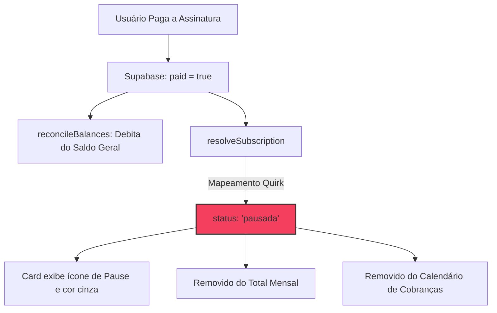

# Flow Trace: Assinaturas & Despesas Recorrentes

O **G-Finance** exige excelência absoluta em todas as camadas. Este trace mapeia a experiência técnica, de banco de dados e de usabilidade da página de **Assinaturas (Subscriptions & Recurrent Expenses)** ([page.tsx](file:///d:/APPS%20-%20ANTIGRAVITY/G-Finance/src/app/subscriptions/page.tsx)), contrastando a intenção de design (*Fluxo Ideal*) com o comportamento de runtime real (*Fluxo Real*).

---

## 📊 Visão Geral do Fluxo

- **Páginas Afetadas:** `/subscriptions` ([page.tsx](file:///d:/APPS%20-%20ANTIGRAVITY/G-Finance/src/app/subscriptions/page.tsx))
- **Personas Analisadas:** 
  - **First-Time User (Zero State):** Cache limpo, sem assinaturas recorrentes cadastradas, dependente de sinalização visual para primeiro input.
  - **Steady-State User (Regular User):** Múltiplas despesas fixas (Netflix, Spotify, ChatGPT), monitora o calendário mensal de saídas e projeções.
- **Eixo Primário:** **Cognitive Clarity** (eliminação de ruído na visualização de calendários e estados de pagamento).
- **Eixo Secundário:** **Conversion** (facilidade para adicionar, mutar ou atualizar recorrências diretamente da UI).

---

## 🗺️ Tabela Comparativa (Ideal vs Real)

| Step | Persona | Fluxo Ideal (Design Spec) | Fluxo Real (Empírico) | Div. | Confiança | Drop-off / Friction Point |
| :---: | :--- | :--- | :--- | :---: | :--- | :--- |
| **1** | First-Time | Acessa `/subscriptions`, visualiza o empty state e um botão para "Adicionar Assinatura" ou "Falar com o Gemini". | Carrega spinner de loading e exibe empty state estático. **Não há nenhum botão de ação** para cadastrar ou gerenciar. | `~` | Verified | **Fricção Inicial:** O usuário fica "preso" em uma tela sem CTA ativo. É forçado a descobrir que o cadastro só ocorre enviando mensagem ao chat de IA. |
| **2** | Steady-State | Visualiza a grade de cards com as cores e ícones específicos das marcas (Netflix, Spotify, ChatGPT). | Cards usam cores sequenciais estáticas e mapeamento textual simples de lowercase para ícones. Falha se houver typos. | `~` | Verified | **Perda de Identidade Visual:** Nomes com pequenos erros (ex: "Netfliks" ou "Netflix Premium Duo") herdam o ícone genérico `Repeat` e cores erradas. |
| **3** | Steady-State | Clica no card ou no badge "ativa/pausada" para suspender temporariamente ou editar a assinatura. | Os cards têm a classe `cursor-pointer hover:scale-[1.02]`, mas **não possuem onClick handler**. Nada acontece no clique. | `!=` | Verified | **[BLOCKER] Interação Fantasma:** O design premium promete interatividade (cursor-pointer + hover animado), mas entrega um elemento estático. |
| **4** | Steady-State | Marca a assinatura como paga no mês. O gasto é contabilizado no histórico e a assinatura continua ativa para o mês seguinte. | O código mapeia `paid` (booleano) a `pausada`: `status: rem.paid ? 'pausada' : 'ativa'`. A assinatura marcada como paga é rotulada como "pausada". | `!=` | Verified | **[BLOCKER] Conflito Semântico de Negócio:** Pagar a conta desativa temporariamente a assinatura visualmente, zerando o `Total Mensal` incorretamente. |
| **5** | Steady-State | Visualiza com precisão os dias de cobrança destacados no calendário de 31 dias, sincronizados com o fuso local. | O calendário usa `new Date().getDate()` (local), mas os dias de cobrança vêm de `getUTCDate()` do banco (UTC). | `~` | Verified | **Timezone Leakage / Shift:** Dependendo do horário de persistência do lembrete, a data no calendário pode deslocar +/- 1 dia do vencimento real. |
| **6** | Steady-State | Vê o card de "Próxima Cobrança" atualizado com o serviço mais próximo temporalmente a vencer. | A lógica busca o primeiro serviço ativo a partir de hoje (`day >= today`). Pode quebrar se houver desvio de timezone. | `~` | Inferred | **Desalinhamento Cronológico:** Risco de pular cobranças imediatas nas viradas de fuso. |
| **7** | Steady-State | Pede ao Gemini AI no chat para adicionar uma assinatura. A IA confirma e a tela se atualiza reativamente. | A IA executa `create_user_reminder` no banco, mas a tela **não faz re-fetch automático**. Exige refresh manual do browser. | `!=` | Inferred | **[BLOCKER] Quebra de Sincronia UI/AI:** O usuário vê o sucesso no chat, mas a UI de assinaturas permanece obsoleta até recarregar a página. |

---

## 🔬 Detalhamento de Estados por Step

### Step 3: O Blocker de Interação Fantasma
- **Input:** Clique físico do usuário sobre o card de serviço (ex: "Netflix") ou no botão interno de status "ativa".
- **System:** O React State permanece inalterado. Não há manipulador de eventos na árvore do DOM para processar o clique.
- **Output:** Sem alteração visual em tela. O cursor do mouse vira pointer e o card executa uma transição de escala (`hover:scale-[1.02]`), simulando clicabilidade, mas gerando um beco sem saída cognitivo.
- **Side Effects:** Zero requisições de rede ou mutações de banco de dados.
- **Backstage:** Zero logs gerados.

### Step 4: O Conflito Semântico (Paid vs Paused)
- **Input:** O usuário marca um lembrete recorrente como pago (`paid = true`) por meio do chat do Gemini AI Brain.
- **System:** O Supabase persiste o registro com `paid: true`. O `useEffect` da página de assinaturas faz re-fetch e dispara o `resolveSubscription`, mapeando o registro para `status: 'pausada'`.
- **Output:** O badge do card passa a exibir "pausada" (cor cinza, ícone Pause). O valor da assinatura é removido da soma de `Total Mensal` no topo, e a marcação circular de cobrança desaparece do "Calendário de Cobranças" (pois o calendário filtra `chargeDays` apenas para `status === 'ativa'`).
- **Side Effects:** A alteração do campo `paid` é gravada no banco Supabase na tabela `public.reminders`.
- **Backstage:** O pipeline de reconciliação de saldo é disparado no backend (`reconcileBalances`), deduzindo o valor do saldo geral do usuário, mas deixando o painel de assinaturas em um estado conceitualmente incorreto (um serviço pago não deveria constar como "pausado").

---

## 👻 Phantom Flows & Desvios de Banco

### 1. Drift de Migração: O Campo `is_recurring`
Ao auditar as migrações locais no diretório `supabase/migrations`, constatamos um desalinhamento sério de infraestrutura de banco como código (IaC):
- O arquivo [20260525000000_init_schema.sql](file:///d:/APPS%20-%20ANTIGRAVITY/G-Finance/supabase/migrations/20260525000000_init_schema.sql#L65-L74) cria a tabela `public.reminders` sem a coluna `is_recurring`.
- O código da aplicação filtra as assinaturas por `is_recurring = true` e o Gemini AI insere registros usando essa propriedade.
- **Auditoria Empírica (Supabase MCP):** Executamos uma query direta no banco de produção e constatamos que a coluna `is_recurring` (tipo `boolean`) existe fisicamente no banco remoto. A migração foi alterada diretamente em produção (Hotfix manual), quebrando a fidelidade e a rastreabilidade do repositório Git.

### 2. Código Morto no Bundle
- O ícone `AlertCircle` é importado de `'lucide-react'` na linha 19 de `/subscriptions/page.tsx`, mas não é renderizado em nenhum componente da tela, gerando desperdício mínimo de bundle no cliente.

---

## ⚡ Recomendações e Plano de Correção

| Categoria | Gargalo / Fricção Identificada | Solução Proposta | Custo (S/M/L) |
| :--- | :--- | :--- | :---: |
| **Modelagem / DB** | Drift da coluna `is_recurring` na migração | Atualizar retroativamente o script `20260525000000_init_schema.sql` ou criar uma migração incremental para sincronizar o schema Git com o banco Supabase em produção. | **S** |
| **Lógica** | Conflito semântico: `paid` interpretado como assinatura `pausada` | Criar uma nova coluna no banco `status` (tipo `text` ou `enum` contendo: `'active'`, `'paused'`, `'cancelled'`) para gerenciar o estado da assinatura. A propriedade `paid` deve gerenciar estritamente a quitação do boleto do mês vigente, resetando no início de cada ciclo de cobrança. | **M** |
| **UX / UI** | Interação Fantasma: Cards sem clique mas com cursor de clicabilidade | Implementar uma modal interativa de detalhes ao clicar no card, permitindo editar valor, vencimento, marcar como paga ou pausar/ativar através de um switch real e animado (Micro-interações premium). | **M** |
| **Realtime** | UI estática após ações no chat Gemini AI | Implementar uma assinatura em tempo real via Supabase Realtime Channels no `useEffect` da página para re-carregar os lembretes imediatamente quando houver `INSERT`, `UPDATE` ou `DELETE` na tabela `reminders`. | **S** |
| **Timezone** | Deslocamento de data por timezone no calendário | Tratar datas de vencimento de lembretes estritamente como strings de data pura (`YYYY-MM-DD`) ou normalizar para o fuso local do navegador ao extrair o dia, evitando o uso de `getUTCDate()` puro que sofre influência da hora de persistência. | **S** |

---

## 🏓 Handoff de Especialistas

- **Para [hm-ux-flow](file:///d:/APPS%20-%20ANTIGRAVITY/G-Finance/.agent/workflows/hm-ux-flow.md):** Analisar a jornada de conversão do First-Time User. A ausência de um botão físico para cadastrar despesa recorrente aumenta a carga mental e pode causar desistência do usuário que não compreende a proposta de comando conversacional por chat.
- **Para [hm-qa](file:///d:/APPS%20-%20ANTIGRAVITY/G-Finance/.agent/workflows/hm-qa.md):** Criar cenários de testes unitários para a função `resolveSubscription` simulando múltiplos fusos horários locais e verificando o shift de datas na listagem do calendário.
- **Para [hm-designer](file:///d:/APPS%20-%20ANTIGRAVITY/G-Finance/.agent/workflows/hm-designer.md):** Desenhar a interface da modal de gerenciamento rápido de assinaturas (alinhado aos padrões da Apple/Stripe: dark-first, tipografia limpa, botões com feedbacks táteis e estados de transição suaves).
- **Para [hm-performance](file:///d:/APPS%20-%20ANTIGRAVITY/G-Finance/.agent/workflows/hm-performance.md):** Avaliar o impacto das re-renderizações na página de assinaturas devido ao recálculo do `displaySubs` a partir de múltiplos disparos de fetch sem cache estruturado.
