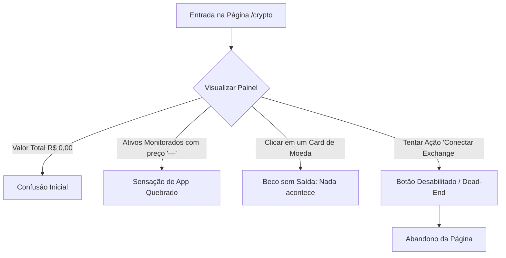

# UX/UI FLOW AUDIT: PORTFOLIO CRIPTO (G-FINANCE)

> [!IMPORTANT]
> **Foco do Audit:** Análise estrita de **qualidade de decisão**, **carga cognitiva** e **jornada do usuário (UX Flow)** conforme o protocolo `/hm-ux-flow`. Estética e UI visual (pertencentes ao `/hm-designer`) não são o foco principal aqui; avaliamos o que o usuário pensa, em qual ordem, com qual nível de fricção e a presença de becos sem saída (*dead-ends*).

---

## 1. MAPEAMENTO DO FLUXO ATUAL

- **Caminho de Entrada:** O usuário clica na aba "Cripto" no menu de navegação lateral.
- **Passos na Tela:** 1 (Página estática de visualização única).
- **Decisões do Usuário:** 0 (Interface totalmente bloqueada/mockada, sem interações reais disponíveis).

---

## 2. ANÁLISE DE DECISÕES (PROTOCOLO /HM-UX-FLOW)

### A. DECISÕES DESNECESSÁRIAS (Unnecessary Decisions)
*   **Aparência de Interatividade Sem Retorno (Falsa Affordance):**
    *   **Gatilho:** Os cards individuais de ativos (BTC, ETH, SOL) possuem classes de hover atraentes (`hover:scale-[1.02] cursor-pointer group relative overflow-hidden transition-all`).
    *   **Problema:** O usuário é levado a decidir se clica no card para ver mais detalhes (como histórico, transações ou gráficos avançados). Ao clicar, **absolutamente nada acontece**.
    *   **Impacto Cognitivo:** Carga cognitiva gasta em uma ação frustrada. O usuário assume que o sistema travou ou que a funcionalidade está quebrada.
    *   **Fix:** Remover as propriedades interativas (`cursor-pointer`, `hover:scale-[1.02]`) enquanto o card for meramente demonstrativo, ou fazer com que o clique abra um modal/drawer explicativo sobre o ativo e mercado.

---

### B. DECISÕES MAL POSICIONADAS (Misplaced Decisions)
*   **Exibição de "Valor Total do Portfolio" Zerado upfront:**
    *   **Gatilho:** O primeiro e maior elemento de leitura na página é um Hero Card com `R$ 0,00` e variação 24h como `—`.
    *   **Problema:** O usuário é forçado a confrontar um estado de "carteira vazia" antes mesmo de entender se ele pode ou não popular o portfolio. O aviso de que não há carteiras conectadas está posicionado de forma secundária e passiva na lateral superior direita.
    *   **Impacto Cognitivo:** Sentimento de fracasso visual imediato. Em vez de ser convidado a interagir ou aprender, o usuário é apresentado a um painel "morto".
    *   **Fix:** Se o usuário não possui ativos ou conexões, a tela deve exibir uma visualização de *Onboarding Ativo*, guiando-o com clareza para a ação inicial apropriada, em vez de simular um painel real zerado.

---

### C. DECISÕES SEM INFORMAÇÃO SUFICIENTE (Decisions without Enough Information)
*   **Falta de Cotações Públicas Básicas:**
    *   **Gatilho:** Os cards de BTC, ETH e SOL mostram o preço estático como `—`.
    *   **Problema:** A cotação de mercado de uma criptomoeda é um dado público que independe de o usuário ter ou não uma carteira conectada.
    *   **Impacto Cognitivo:** Mostrar um traço (`—`) em finanças significa falha de conexão com o backend ou erro de API crítica. O usuário sente insegurança sobre a estabilidade do G-Finance como um todo, assumindo que as APIs de cotação caíram.
    *   **Fix:** Buscar e exibir cotações reais de mercado (via API pública gratuita) ou, no mínimo, exibir um mockup realista e dinâmico que reflita valores reais (ex: R$ 380.000,00 para BTC), indicando que são cotações globais atuais.

---

## 3. FRICTION POINTS CATALOG

| Identificador | Ponto de Fricção | Impacto Psicológico | Solução Concreta (Fix) |
| :--- | :--- | :--- | :--- |
| **FP-01** | **CTA Principal Desabilitado (Dead-End)** O botão "Conectar Exchange" está travado em `disabled` com um rótulo cinza sem escape. | **Frustração Extrema.** O usuário sente que a página é um "panfleto" ou template estático, perdendo o interesse em explorar outras partes do app. | **Remover o Dead-End:** Substituir por um formulário interativo de lista de espera ("Quero ser avisado") ou permitir votação nas exchanges que ele mais usa (Binance, MetaMask, etc.) para capturar dados valiosos de produto. |
| **FP-02** | **Falta de Escape para Lançamento Manual** Não há nenhuma alternativa para o usuário que prefere privacidade e quer declarar manualmente seus saldos (ex: "Tenho 0.5 BTC"). | **Exclusão de Casos de Uso.** Usuários focados em privacidade abandonam o produto porque são obrigados a depender de conexões on-chain/API que ainda nem existem. | **Adicionar Modo Manual:** Criar um botão simples "Adicionar saldo manualmente". Isso destrava o uso da página imediatamente para 100% dos usuários, gerando valor real antes de qualquer integração complexa de API. |
| **FP-03** | **Gráficos (Sparklines) Desconectados da Realidade** Os gráficos vetoriais gerados por sementes matemáticas mostram oscilações estéticas, mas não representam o preço real recente. | **Desconfiança Técnica.** O usuário de cripto é altamente detalhista. Se ele nota que o sparkline do BTC sobe enquanto o indicador de 24h é negativo, ele perde a confiança na precisão matemática do sistema. | **Vincular Sparkline a dados históricos reais** (ou mockups consistentes). O gráfico deve refletir perfeitamente o preço atual e a variação percentual exibida no topo do card. |

---

## 4. AVALIAÇÃO DO ESTADO ZERO (EMPTY STATE) & LOADING

### Estado Zero (Empty State)
*   **Avaliação:** **CRÍTICA / INSUFICIENTE**.
*   A página atualmente usa o antipadrão de **"Falso Dashboard"**. Ela desenha uma estrutura de painel ativo com valores zerados e traços, em vez de assumir que é um estado inicial vazio.
*   **O que falta:** Um Empty State real e inspirador que explique os benefícios do módulo Cripto, forneça suporte visual para o usuário e dê a ele uma ação imediata (como simular um portfólio ou entrar para a lista de testes).

### Estado de Carregamento (Loading State)
*   **Avaliação:** **INEXISTENTE**.
*   Como a página renderiza dados 100% estáticos diretamente no lado do cliente, não há estado de transição assíncrono.
*   **O que falta:** Se adicionarmos cotações reais, precisamos de um layout de esqueleto (*Skeleton Shimmers*) correspondente para os preços e gráficos de sparkline para mitigar a percepção de latência do usuário.

---

## 5. RECOVERY DE ERRO (Error Recovery)

*   **Avaliação:** **INEXISTENTE**.
*   Não há tratamento de erros visível na interface para cotações indisponíveis ou problemas de rede. Exibir traços (`—`) silenciosamente sem nenhuma explicação é um antipadrão de tratamento de erros silenciosos.
*   **Recomendação:** Implementar um componente de *Error Boundary* ou um banner local amigável: *"Não foi possível carregar as cotações em tempo real. Exibindo últimos valores salvos offline. [Tentar novamente]"*.

---

## 6. VEREDICTO FINAL: REDESIGN

### Justificativa Psicológica
A página `/crypto` atual falha em entregar valor real e adota práticas que causam **frustração de expectativa** e **sensação de software inacabado/quebrado** (falsas affordances de clique, dados estáticos com traços de erro `—`, e um botão principal desabilitado sem nenhuma alternativa de saída). 

Para atingir o padrão **World-Class** exigido pelo Guilherme (Stripe/Linear/Vercel standard), a interface não pode ser apenas um mockup estático bonito. Ela deve respeitar a inteligência do usuário e fornecer utilidade prática imediata.

---

## 7. PLANO DE AÇÃO PARA REDESIGN (UX-Centric)

1.  **Eliminar o estado morto das cotações:**
    *   Substituir os traços (`—`) por preços reais e vivos gerados via API ou, em caso de fallback, mocks dinâmicos realistas baseados na cotação real do mercado no momento do deploy.
2.  **Adicionar o "Modo de Rastreamento Manual" (Quick Win de Valor Real):**
    *   Implementar um modal simples de "Adicionar Ativo Manual" onde o usuário possa preencher a quantidade que possui de BTC, ETH ou SOL.
    *   Fazer com que o "Valor Total do Portfolio" reaja em tempo real ao saldo inserido pelo usuário multiplicado pela cotação do ativo.
3.  **Substituir o Botão Desabilitado por um Canal de Feedback Ativo:**
    *   Remover o botão cinza inativo.
    *   Adicionar um botão de engajamento ativo: *"Quero Conectar Minhas Carteiras"* que abre um formulário minimalista para coletar o e-mail do usuário e quais exchanges ele deseja priorizar. Isso demonstra que o app está ouvindo o usuário e evoluindo dinamicamente.
4.  **Corrigir a Acessibilidade dos Cards de Moedas:**
    *   Remover o cursor de ponteiro e o efeito de hover dos cards, a menos que adicionemos um drawer lateral de detalhes de mercado para cada moeda quando clicada.
