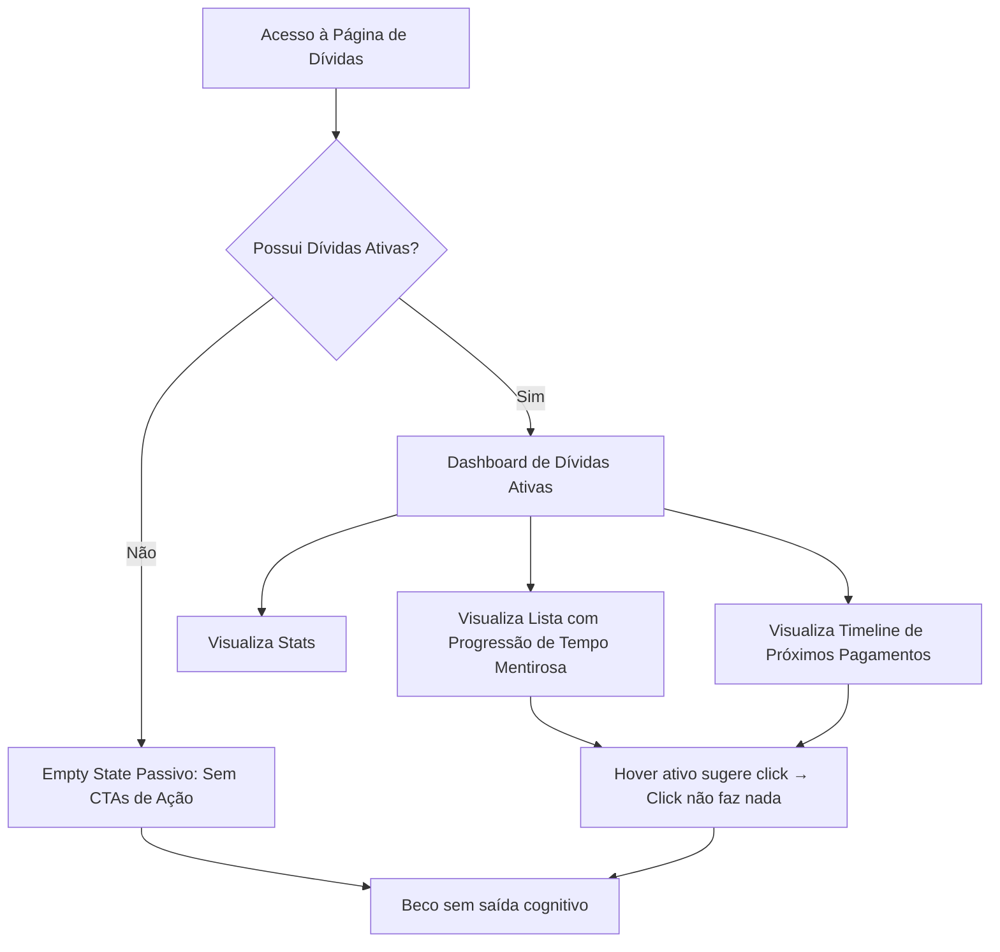

# UX FLOW AUDIT: Controle de Dívidas (Debts Management)

> [!IMPORTANT]
> **Owner/CTO Rule Alignment**: World-class engineering does not tolerate silent failures or deceptive interface metrics. A financial application must be an instrument of truth and action, not a passive scoreboard of stress.

---

## 1. Visão Geral e Mapeamento de Fluxo

**Fidelidade do Fluxo Atual:**
- **Passos:** 1 passo (Totalmente Estático / Somente Leitura)
- **Decisões do Usuário:** 0 decisões acionáveis dentro da página

O fluxo atual da página [page.tsx](file:///d:/APPS%20-%20ANTIGRAVITY/G-Finance/src/app/debts/page.tsx) é puramente de **consumo passivo**. O usuário entra na página para visualizar seus passivos, mas é colocado em um beco sem saída (dead-end) cognitivo, onde ele pode observar suas dívidas atrasadas ou a vencer, mas não possui nenhuma ferramenta direta para gerenciá-las, marcá-las como pagas, editá-las ou adicionar novas obrigações.

---

## 2. Análise de Decisões e Carga Cognitiva

### A. Decisões Desnecessárias
- **Nenhuma (Paradoxalmente):** Por ser uma interface 100% de leitura, o sistema não pede que o usuário tome decisões explícitas na UI. Contudo, isso gera uma **carga de decisão oculta**: o usuário é forçado a decidir manualmente fora da plataforma *como*, *quando* e *onde* ele irá pagar aquela dívida, além de ter que navegar para outra seção do sistema para registrar transações de quitação.

### B. Decisões Mal Posicionadas
- **Ausência de Ações Críticas de Gestão:** A decisão de amortizar, liquidar ou adiar uma dívida pertence conceitualmente a esta tela. Obrigar o usuário a sair da tela de "Controle de Dívidas" para registrar um pagamento no fluxo geral de transações ou lembretes é uma quebra severa de contexto.
- **Previsão de Quitação Imprecisa:** O card de "Previsão de Quitação" toma uma decisão analítica errônea por padrão. Ele apenas localiza a dívida com a data de vencimento mais distante e projeta que o usuário estará "quitado" ali. Isso cria um falso sentimento de segurança se o usuário tiver dívidas recorrentes ou contratos de longo prazo não mapeados individualmente.

### C. Decisões Sem Informação Suficiente (Grave Dissonância Cognitiva)
- **O Métrica de Progresso "Tempo Decorrido" (`getTimeProgress`):**
  - A barra de progresso em cards de dívida possui uma convenção mental universal estabelecida no ecossistema financeiro: **indicar a quitação/amortização do saldo** (ex: R$ 500 pagos de R$ 1.000 = 50% de progresso, rumo ao objetivo positivo de quitação).
  - Em [page.tsx](file:///d:/APPS%20-%20ANTIGRAVITY/G-Finance/src/app/debts/page.tsx#L54-L62), a barra de progresso indica o **tempo decorrido desde a criação do lembrete até o vencimento**. 
  - Isso inverte a conotação psicológica: uma barra cheia (100%) que visualmente sugere "conclusão de meta/sucesso" na verdade indica **vencimento/perigo máximo (atraso)**.
  - A fórmula também utiliza um fallback arbitrário de 30 dias se `created_at` estiver ausente, tornando a escala do progresso sem sentido real para o prazo da dívida.
  - **Fricção Mental Extrema:** O cérebro do usuário precisa decodificar ativamente um indicador de preenchimento positivo para perceber que ele significa um evento negativo (tempo esgotado).

---

## 3. Friction Points Catalogados

| Friction Point | Impacto Cognitivo | Fix Proposto |
| :--- | :--- | :--- |
| **Beco sem Saída Acionável** | Ansiedade passiva. O usuário vê dívidas atrasadas (`isPastDue`), mas não há botão "Pagar" ou "Marcar como Pago". | Implementar botões rápidos de ação (`Quick-Settle`) diretamente nos cards e timeline. |
| **Falsas Acessibilidades (False Affordances)** | Frustração de interatividade. Os cards de dívida ativa e itens da timeline têm efeito de hover (`hover:border-white/10`) e cursor clicável, mas clicar não produz reação. | Adicionar uma gaveta (Drawer/Slide-over) de detalhes ao clicar ou remover o estado visual de hover até haver interatividade. |
| **Loading Monótono (Reprovado)** | Percepção de lentidão e falta de polimento. O spinner de rotação crua quebra a sensação de aplicação "Premium". | Substituir por **Shimmer Skeletons** que imitam o layout dos cards e estatísticas durante a carga assíncrona. |
| **Falta de Botão "Novo compromisso"** | Dificuldade de Onboarding. O usuário que entra na página pela primeira vez recebe um empty state estático sem a capacidade de adicionar um débito. | Adicionar um botão de ação primária "Registrar Dívida" no topo da página e no centro do empty state. |

---

## 4. Auditoria de Resiliência e Recovery de Erro

> [!CAUTION]
> ### FALHA CRÍTICA DE INTEGRIDADE DA INFORMAÇÃO
> No bloco de código [fetchDebts](file:///d:/APPS%20-%20ANTIGRAVITY/G-Finance/src/app/debts/page.tsx#L68-L91), qualquer erro de conexão com o Supabase ou expiração de sessão é silenciosamente engolido (`console.error`).
>
> **Consequência Devastadora de UX:**
> 1. Se a requisição falhar por falta de internet ou erro de banco de dados, `debts` permanece como array vazio `[]`.
> 2. O componente de carregamento é desativado (`setLoading(false)`).
> 3. O usuário é apresentado com o **Empty State Alegre**:
>    *"Nenhuma dívida registrada. Sua saúde financeira está impecável!"*
> 
> **Veredicto Clínico:** Isso induz o usuário ao erro gravíssimo de acreditar que não possui obrigações ativas quando, na verdade, o sistema apenas falhou em carregá-las. Em aplicações financeiras, mentir sobre a ausência de dívidas devido a uma falha de rede é inaceitável.

---

## 5. Estados Vazios e Mobile UX

### A. Empty States
- **Falta Afordance de Início:** O estado vazio é puramente ilustrativo. Ele parabeniza o usuário de forma prematura e não oferece nenhum caminho para criar a primeira dívida.
- **Correção:** Transformar em um ponto de conversão com um CTA primário `Adicionar Dívida`.

### B. Mobile UX
- **Scroll Chaining:** As listas internas possuem `max-h-[540px] overflow-y-auto`. Em dispositivos touch, isso gera conflito com o scroll nativo da página principal, prendendo o gesto do usuário dentro da lista.
- **Bottom Sheets:** Em mobile, qualquer interação futura com cards (editar/pagar) deve ser mapeada para Bottom Sheets em vez de modais flutuantes centralizados.

---

## 6. UX VERDICT & ROADMAP DE REDESENHO

### VERDICT: `REDESIGN` 🚨 (REPROVADO NA BARRA WORLD-CLASS)

A página atual atua apenas como um widget de visualização de baixa fidelidade funcional e alta carga de ansiedade passiva. Para atingir o padrão de excelência de marcas como Stripe, Linear ou Airbnb, a página precisa evoluir de uma **tabela estilizada** para uma **ferramenta de planejamento tático de quitação**.

### Plano de Ação para Redesenho:

1. **Ação Rápida de Quitação (Quick-Settle):**
   - Introduzir um botão sutil de check "Marcar como Pago" direto no card. Isso executa uma mutação otimista no banco, enviando a dívida para a tabela de transações e atualizando o saldo real imediatamente com um feedback táctil suave.

2. **Substituição da Métrica de Tempo:**
   - Remover a barra de progresso temporal linear que causa dissonância cognitiva.
   - Substituí-la por um indicador visual de **tempo restante absoluto** (ex: "Vence em 4 dias", "Atrasado há 2 dias") com código de cores HSL minimalista e elegante.
   - Reservar barras de progresso para **metas de amortização** (caso a dívida seja parcelada, ex: "Pago 4/12 parcelas").

3. **Resiliência contra Falhas de Rede:**
   - Adicionar estado explícito de erro (`hasError` ou `errorState`). Se a consulta falhar, mostrar uma tela de recuperação com a mensagem: *"Não conseguimos sincronizar seus compromissos financeiros. [Tentar Novamente]"*, impedindo a exibição do empty state mentiroso.

4. **Transição Premium (Zero Jank):**
   - Substituir o Spinner genérico por skeletons cintilantes (shimmering skeletons) que revelam o esqueleto da interface de forma suave, reduzindo a percepção de tempo de espera.
