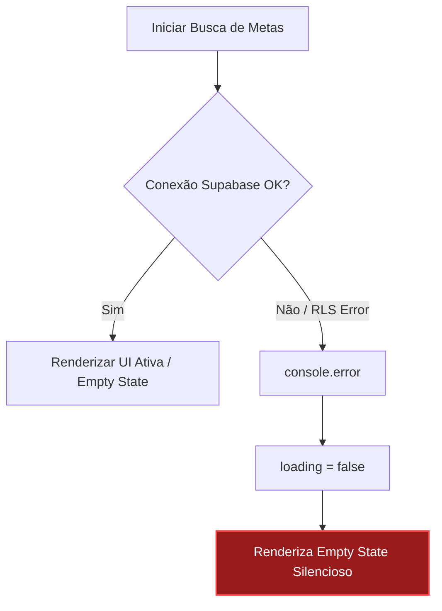

# 🧠 /hm-ux-flow — Relatório de Auditoria UX
**Produto:** G-Finance  
**Página:** `Investimentos & Patrimônio` (`/wealth`)  
**Data:** 27 de Maio de 2026  
**Auditor:** Antigravity (UX/UI Psychologist Subagent)  
**Veredicto UX:** `OPTIMIZE` ⚠️ (Aproxima-se do padrão *world-class*, mas possui fricções severas na tomada de decisão e integridade matemática)

---

## 🗺️ Mapeamento do Fluxo Atual
A página de **Investimentos & Patrimônio** serve como o painel central de visualização de riqueza do usuário. Ela consome dados de metas financeiras do Supabase e renderiza cards de progresso, um gráfico Donut de alocação de portfólio e métricas globais.

### Fluxos Críticos Analisados:
1. **Primeiro Acesso (Empty State / Zero State)** — Jornada de um usuário sem metas cadastradas.
2. **Visualização de Patrimônio & Metas (Active Investor)** — Jornada de monitoramento diário da evolução patrimonial.

---

## 🎯 Análise Crítica de Decisões do Usuário

### 1. Decisões Desnecessárias
*   **Forçar a Visualização de Alocação de Corrente Única:** O gráfico de Donut reflete estritamente a alocação do saldo *atual* (`current_amount`). Para um investidor de longo prazo, a alocação de *destino* (as metas almejadas) é tão ou mais importante quanto o saldo de hoje. Forçar o usuário a ver apenas o saldo atual gera uma desconexão cognitiva sobre se o portfólio está balanceado em direção aos objetivos futuros.
    *   *Fix:* Implementar um toggle simples (micro-decisão de alta informação) para alternar entre "Alocação Atual" e "Alocação Almejada (Target)".

### 2. Decisões Mal Posicionadas
*   **Redirecionamento para "Ajustes" para Gestão de Metas:**
    No empty state, o texto diz: *“Defina seus objetivos de crescimento patrimonial nos Ajustes para começar a acompanhar seu progresso.”*
    Esta decisão é extremamente mal posicionada. O usuário está no dashboard de *Investimentos*, com a mentalidade focada em construir riqueza. Ao se deparar com uma tela vazia, em vez de poder agir imediatamente criando sua primeira meta (ação contextual), ele é forçado a:
    1. Abandonar a página `/wealth`.
    2. Procurar o menu de "Ajustes" na sidebar lateral (sem nenhum link direto ou affordance visual clara na página).
    3. Descobrir onde nos Ajustes as metas são gerenciadas.
    4. Configurar e depois lembrar de retornar a `/wealth`.
    *   *Fix:* Mover a criação de metas para um painel inline (CRUD modal ou Drawer) diretamente na página de Investimentos. Se os Ajustes forem necessários, fornecer pelo menos um botão primário com link direto para a seção correta das configurações.

### 3. Decisões sem Informação Suficiente (Falta de Contexto)
*   **Métrica Ilusória de Progresso Médio (Meta Global):**
    O cálculo atual de `averageProgress` realiza uma média aritmética simples do progresso individual de cada meta:
    $$\text{Progresso Médio} = \frac{\sum \min(\frac{\text{current}}{\text{target}} \times 100, 100)}{\text{Total de Metas}}$$
    *   *Cenário Crítico:* Se o usuário tem duas metas:
        1. "Reserva de Emergência": Meta de R$ 1.000,00 (100% concluída, R$ 1.000,00 acumulados).
        2. "Comprar um Imóvel": Meta de R$ 1.000.000,00 (0.1% concluída, R$ 1.000,00 acumulados).
    *   *Resultado:* O sistema exibe um progresso de **50% da meta global**! O usuário vê um badge verde brilhante com um ícone de crescimento (`ArrowUpRight`) indicando que ele está na metade do seu objetivo financeiro, quando na verdade ele acumulou apenas R$ 2.000,00 de uma meta consolidada de R$ 1.001.000,00 (0,19% do real total).
    *   *Impacto Cognitivo:* Desonestidade matemática não-intencional. O usuário toma decisões de alocação de capital baseado em um sentimento inflado de segurança.
    *   *Fix:* Substituir o cálculo por progresso consolidado real ($\frac{\text{Total Investido}}{\text{Total Target}}$) ou renomear a métrica explicitamente para "Média de Conclusão dos Projetos".

---

## ⚡ Catálogo de Friction Points

| Identificador | Fricção Encontrada | Categoria | Impacto | Resolução Proposta (Fix) |
| :--- | :--- | :--- | :--- | :--- |
| **FP-01** | **Dead-end no Empty State** | Navegação | Crítico | Adicionar um botão de ação primária `Criar Nova Meta` que abre um modal na própria página ou redireciona diretamente com `router.push('/settings/goals')`. |
| **FP-02** | **Donut Chart "Fantasma" com Saldo Zero** | Consistência Visual | Médio | Se o saldo investido total for zero, o gráfico retorna `null`, mas a div pai e o brilho (`emerald-500/5`) ainda são renderizados. Isso gera um vazio visual bizarro no lado direito do painel. Mostrar uma ilustração placeholder minimalista ou omitir o container inteiro. |
| **FP-03** | **Badge de Progresso Positivo Estático** | Affordance | Leve | O badge de progresso global usa `ArrowUpRight` e cor verde por padrão, mesmo que o progresso do usuário seja de 0% ou tenha caído. Isso passa uma falsa sensação de "crescimento constante" sem conexão real com o histórico. |
| **FP-04** | **Metas não-interativas** | Engajamento | Médio | Clicar em um card de meta não faz absolutamente nada. Não é possível ver o histórico de depósitos, taxas de juros presumidas ou prazos de conclusão. O usuário fica sem saber qual a ação seguinte. |

---

## 🛡️ Avaliação de Error Recovery (Resiliência)

*   **Comportamento Atual:** Se a consulta ao Supabase falhar (por exemplo, token expirado, erro de rede, ou falha nas regras de RLS), o erro é apenas capturado no console (`console.error('Error fetching goals:', err)`), o estado de carregamento é desativado e o usuário vê a tela de **"Nenhuma meta de investimento ativa"**.
*   **Diagnóstico de UX:** Falha gravíssima. O usuário que possui milhares de reais investidos cadastrados entra na página, depara-se com um estado vazio e assume que seus dados foram deletados do banco de dados, gerando pânico severo.
*   **Fix Requerido:** Implementar um banner de erro explícito com feedback de rede e um botão de ação rápida para tentar novamente (`Tentar Novamente`), mantendo os dados antigos em cache/state caso disponíveis.

---

## 🧩 Empty & Loading States

### Empty State (Estado Zero)
*   **Visual:** Elegante e limpo, com ícone de alvo minimalista.
*   **Decisão/Ação:** **Reprovado.** Não há botão ou ação para guiar o usuário. O texto indica que o usuário deve ir para "Ajustes", mas não oferece um caminho funcional.
*   **Correção:** Inserir um botão de chamada para ação (CTA): `[ Adicionar Primeira Meta ]` abrindo um drawer simples de cadastro.

### Loading State (Estado de Carregamento)
*   **Comportamento:** Exibe um spinner giratório central verde em tela cheia (`animate-spin`).
*   **Diagnóstico de UX:** **Reprovado.** Viola a regra nº 10 do protocolo `/hm-ux-flow`. O carregamento em tela cheia bloqueia toda a navegação e o contexto visual da página, causando um salto de layout abrupto (layout shift) quando os dados terminam de carregar.
*   **Correção:** Substituir o spinner central por um **Skeleton Screen (Shimmer)** que imite a estrutura dos cards de metas e do patrimônio total, reduzindo a percepção de tempo de espera do usuário.

---

## ⚖️ UX Verdict

# **VEREDICTO: OPTIMIZE ⚠️**

A página de Investimentos possui uma fundação estética espetacular (dark mode premium, gradientes suaves de esmeralda, tipografia editorial afiada), porém falha severamente em termos de psicologia de tomada de decisão, resiliência de erro e integridade matemática.

### Principais Ações de Engenharia UX Recomendadas:
1.  **Corrigir a Métrica Global:** Mudar o progresso médio aritmético para progresso financeiro ponderado real.
2.  **Destruir o Dead-End:** Permitir a criação/edição de metas na própria página `/wealth` via modal ou drawer, eliminando a dependência do fluxo "Ajustes".
3.  **Tornar os Skeletons Padrão:** Eliminar o spinner genérico e implementar shimmers elegantes simulando os cards de investimento.
4.  **Tratamento Honesto de Erro:** Mostrar um estado de erro contextualizado em vez de um falso "Zero State".

---
*Relatório de conformidade UX gerado com base nas diretrizes de engenharia premium de G-Finance.*
