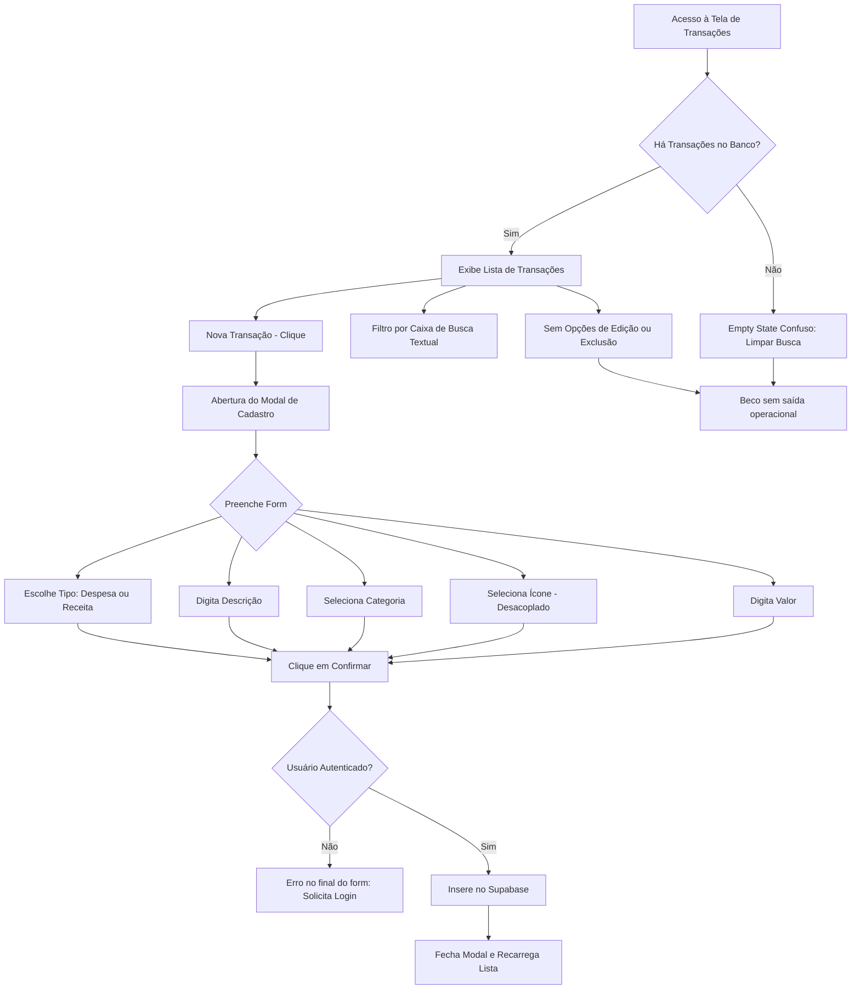

# UX FLOW AUDIT: Lista de Transações (Transactions List)

> [!IMPORTANT]
> **Owner/CTO Rule Alignment**: World-class engineering demands extreme clarity and a frictionless interactive flow. Every cognitive step must be justified, and the interface must protect user data integrity at all costs. The current architecture forces unnecessary choices and leaves critical actions locked in dead-ends.

---

## 1. Visão Geral e Mapeamento de Fluxo

**Fidelidade do Fluxo Atual:**
- **Passos:** 2 passos principais (Visualização/Busca e Criação Manual de Transações).
- **Decisões do Usuário:** 4 decisões de formulário redundantes ou incoerentes por transação criada.

A página [page.tsx](file:///d:/APPS%20-%20ANTIGRAVITY/G-Finance/src/app/transactions/page.tsx) exibe o extrato financeiro histórico e permite a adição manual de novas transações. No entanto, ela peca gravemente na flexibilidade operacional: uma vez criada, a transação torna-se imutável e indelével a partir da UI (beco sem saída operacional). Além disso, o fluxo de criação impõe escolhas redundantes de dados e ignora metadados fundamentais (como a data real da transação).

---

## 2. Análise de Decisões e Carga Cognitiva

### A. Decisões Desnecessárias
- **Desacoplamento de Categoria e Ícone (Redundância Cognitiva):**
  - O formulário de criação em [page.tsx](file:///d:/APPS%20-%20ANTIGRAVITY/G-Finance/src/app/transactions/page.tsx#L287-L316) exige que o usuário decida a `Categoria` e depois decida o `Ícone` manualmente de forma separada.
  - **Incoerência de Catálogo:** A categoria `Transporte` existe no dropdown de categorias, mas o ícone correspondente `Car` (mapeado no código) **não está disponível** no dropdown de ícones! O usuário que seleciona `Transporte` é forçado a escolher um ícone sem sentido como `Tv` (Lazer) ou `Zap` (Utilidades).
  - **Inconsistência de Dados:** Permite a criação de combinações absurdas, como Categoria `Salário` vinculada ao ícone `ShoppingCart` (Compras) ou Categoria `Saúde` vinculada ao ícone `Tv`.
  - **Fix Proposto:** Eliminar totalmente a seleção manual de ícone. Mapear deterministicamente um ícone de alta qualidade para cada categoria no back-end/helper e remover esse ruído cognitivo do usuário final.

### B. Decisões Mal Posicionadas
- **Ausência de Campo de Data (Data Obrigatória Oculta):**
  - O sistema decide implicitamente a data da transação como a hora exata do clique de envio (`date: new Date().toISOString()`).
  - **Quebra de Modelo Mental:** Usuários raramente lançam todas as transações em tempo real. Grande parte do fluxo financeiro manual envolve registrar despesas passadas (ex: "Jantar de ontem") ou agendar receitas futuras. Forçar a data atual impede a precisão histórica e irrita o usuário que precisa manter o extrato sincronizado.
  - **Fix Proposto:** Adicionar um campo de entrada de data (`input type="date"`) no formulário, pré-preenchido com o dia de hoje, mas totalmente editável.
- **Validação de Autenticação Tardia (Misplaced Check):**
  - O sistema aguarda o preenchimento de todo o formulário para verificar se existe uma sessão ativa (`supabase.auth.getUser()`). Caso não haja, retorna um erro frustrante.
  - **Fix Proposto:** Impedir o clique em "Nova Transação" ou desabilitar o formulário com um overlay elegante caso o estado de autenticação seja inválido antes que o usuário gaste energia preenchendo os dados.

### C. Decisões Sem Informação Suficiente
- **Dropdown de Ícones Puramente Textual:**
  - O select do ícone descreve o símbolo textualmente (ex: `Lazer (Tv)`, `Compras (Carrinho)`), mas não exibe o glifo visual. O usuário precisa adivinhar o resultado estético final.
  - **Fix Proposto (se mantido a seleção):** Substituir o dropdown nativo por uma grade visual de ícones interativa (Popover Grid) com hover e seleção instantânea.
- **Falta de Feedback no Input de Valor:**
  - O input `Valor (R$)` aceita apenas números brutos. O seletor de tipo (Despesa / Receita) fica no topo e não altera o comportamento visual do campo de valor (ex: mostrar sinal negativo `- R$` ou mudar a cor da borda/texto para vermelho ou verde com base na seleção). O usuário clica em "Confirmar" sem a certeza visual absoluta de que o valor inserido subtrairá ou somará do seu saldo total.
  - **Fix Proposto:** Adicionar um prefixo dinâmico no input de valor: `- R$` para despesas em vermelho sutil HSL, e `+ R$` para receitas em verde esmeralda.

---

## 3. Friction Points Catalogados

| Friction Point | Impacto Cognitivo | Fix Proposto |
| :--- | :--- | :--- |
| **Imutabilidade Operacional (Dead-End)** | Desespero do usuário. Errar um dígito no valor ou na descrição obriga o usuário a conviver com o erro para sempre, já que não há botões de **Editar** ou **Excluir** transação na UI. | Implementar uma coluna de ações de linha na tabela contendo um botão de menu (três pontos) para abrir modais de **Excluir** (com aviso de confirmação) e **Editar** (reaproveitando o modal existente). |
| **Filtros Inexistentes** | Carga de busca elevada. Para ver apenas as despesas de alimentação ou as receitas, o usuário precisa digitar termos específicos na barra de busca geral. Não há filtros por período ou tipo. | Adicionar uma barra de tags rápidos de filtro acima da lista: `[Todas]`, `[Apenas Despesas]`, `[Apenas Receitas]`, `[Este Mês]`, `[Mês Passado]`. |
| **Escalabilidade Comprometida** | Latência e consumo de rede. A consulta Supabase puxa todas as transações existentes de uma só vez (`select('*')`). Com milhares de registros, a renderização e o filtro em memória (`transactions.filter`) causarão travamentos severos da thread do navegador. | Migrar a busca e paginação para o servidor utilizando parâmetros de query no Supabase (`range(from, to)`) e rolagem infinita (Infinite Scroll) ou paginação com shimmer skeletons. |
| **Hover de Linha Sem Direcionamento** | Falsa acessibilidade. A linha da tabela possui efeito visual rico de hover (`hover:bg-white/40 group`) e o ícone ganha cor ativa, sugerindo que clicar na linha abrirá uma gaveta de detalhes ou edição, mas o clique não gera ação. | Mapear o clique da linha para abrir uma gaveta lateral (Drawer/Slide-over) com os detalhes profundos daquela transação ou remover o cursor clicável e o efeito enganoso de foco da linha inteira. |

---

## 4. Auditoria de Resiliência e Recovery de Erro

> [!CAUTION]
> ### ENGOLIMENTO DE ERROS E ALIMENTAÇÃO DE DADOS INVISÍVEIS
> Em [fetchTransactions](file:///d:/APPS%20-%20ANTIGRAVITY/G-Finance/src/app/transactions/page.tsx#L57-L72), qualquer falha na comunicação de rede com o Supabase ou expiração de token de acesso é apenas logada no console com `console.error`.
>
> **Comportamento Catastrófico de UX:**
> 1. Se a chamada falhar, o estado `transactions` permanece como array vazio `[]` e `loading` torna-se `false`.
> 2. O usuário cai direto na tela de **Empty State de Busca**:
>    *"Nenhuma transação encontrada para a busca atual."*
> 3. Isso engana gravemente o usuário, induzindo-o a achar que sua conta está zerada ou que seus dados foram deletados, quando na verdade ocorreu apenas um problema de conexão local ou temporário no banco de dados.
>
> **Correção Inegociável:** Criar um estado de erro explícito (`hasError` / `errorMessage`). Se a requisição falhar, bloquear a exibição de listas ou empty states e exibir um card elegante de erro: *"Não conseguimos sincronizar suas transações mais recentes. [Tentar Novamente]"*.

---

## 5. Estados Vazios e Mobile UX

### A. Empty States
- **Dissonância no Vazio Absoluto:**
  - Se a tabela estiver vazia por falta de registros no banco (usuário novo), a UI renderiza o texto *"Nenhuma transação encontrada para a busca atual."* e um botão *"Limpar Busca"*.
  - O botão "Limpar Busca" não faz absolutamente nada porque a busca já está vazia. O usuário novo fica sem orientação de onboarding sobre o que fazer.
  - **Correção:** Tratar separadamente o estado vazio de busca e o estado vazio do banco. Se `transactions.length === 0`, exibir um empty state receptivo com uma ilustração premium de boas-vindas e um botão primário destacado para **"Cadastrar Primeira Transação"**.

### B. Mobile UX
- **Rolagem Conflitante:**
  - A estrutura utiliza `overflow-y-auto` na tag `main`. Em dispositivos móveis, rolar a tabela em horizontal e vertical gera bloqueio de scroll na página externa.
  - **Modais vs. Bottom Sheets:** O modal de criação de transações é uma caixa flutuante centralizada. Em telas menores que 640px, os campos ficam apertados e o teclado virtual móvel cobre os inputs inferiores (como o input de valor e o botão de salvar).
  - **Correção:** Em resoluções móveis, converter o modal centralizado em um **Bottom Sheet** deslizante nativo que se posiciona perfeitamente sobre a metade inferior da tela, garantindo que os campos ativos fiquem acima do teclado do sistema.

---

## 6. UX VERDICT & ROADMAP DE REDESENHO

### VERDICT: `REDESIGN` 🚨 (REPROVADO NA BARRA WORLD-CLASS)

O fluxo de Transações atual funciona como um formulário estático rudimentar em termos de usabilidade. A falta de edição/exclusão, a redundância cansativa de ter que escolher um ícone desconectado para cada categoria (e a falha de não ter o ícone do meio de transporte disponível no dropdown) e o perigo latente de exibir um extrato zerado falso em erros de rede colocam a página abaixo do nível de excelência exigido.

### Plano de Ação para Redesenho:

1. **Fusão de Categoria e Ícone:**
   - Remover o dropdown de Ícones.
   - Definir em código uma tabela fixa de associação:
     - `Lazer` $\rightarrow$ `Tv`
     - `Alimentação` $\rightarrow$ `ShoppingCart`
     - `Salário` $\rightarrow$ `ArrowDownLeft`
     - `Transporte` $\rightarrow$ `Car`
     - `Saúde` $\rightarrow$ `Activity`
   - O ícone correspondente passa a ser renderizado de forma invisível e automatizada ao selecionar a categoria no banco de dados.

2. **Inclusão da Data Histórica:**
   - Adicionar o campo opcional de data ao formulário do modal, preenchendo por padrão com `new Date().toISOString().split('T')[0]`.

3. **Operações de Modificação (Edição e Exclusão):**
   - Adicionar botões discretos e elegantes ao final de cada linha da tabela (ou em uma gaveta lateral de detalhes ao clicar na linha) para permitir a **Exclusão** (destrutiva e com verificação em dois passos) e **Edição** da transação para ajustar valores e categorias errados.

4. **Tratamento de Estado de Conexão:**
   - Validar retorno de erro da API e exibir aviso explícito de falha de conexão no lugar de induzir o usuário a achar que seus lançamentos sumiram.

5. **Interface Premium de Carregamento:**
   - Substituir o Spinner verde giratório por um layout elegante de **Shimmer Skeletons** imitando a tabela de transações, mantendo a transição de estado suave e profissional (Zero Jank).
