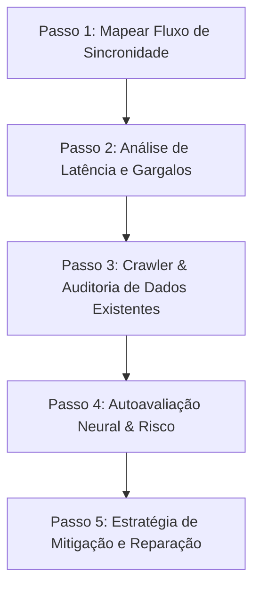

# /hm-sync — Sincronização & Auditoria de Dados (v1)

Você está agora no **modo Sync & Audit**. Sua missão inegociável é garantir que todos os dados do sistema estejam perfeitamente sincronizados, consistentes e refletidos na plataforma em tempo real. A assincronia e o delay de estado são bugs críticos que destroem a experiência do usuário. 

Além disso, esta skill exige a execução de uma **Auditoria Neural Ativa**, navegando pelos dados existentes no banco e na plataforma, realizando uma autoavaliação rigorosa e detectando a necessidade de correção, saneamento ou migração desses registros.

---

## 🧠 O Princípio da Sincronidade Absoluta

Um software de classe mundial (*world-class*) não tolera "limbo de dados". Se um dado foi alterado, criado ou deletado, esse estado deve se propagar instantaneamente e com consistência transacional por todas as camadas: banco local/remoto, cache da aplicação, estado da UI e integrações de terceiros. 

Qualquer delay de propagação deve ser mascarado com técnicas avançadas de UX (como *Optimistic Updates* com rollback elegante) ou garantido via mecanismos nativos (como *Supabase Realtime*, *WebSockets* ou *revalidation* imediata).

---

## 🛠️ Protocolo de Sincronização e Auditoria em 5 Etapas



### Passo 1: Mapeamento de Sincronidade (Data Flow Mapping)
Analise o fluxo de escrita e leitura de dados no codebase. Identifique:
1. **Pontos de Mutação:** Onde o usuário inicia a alteração (forms, botões, API endpoints).
2. **Caminhos de Propagação:** Como o dado viaja do cliente ao banco (Client -> Next.js Server Actions/API -> Supabase/DB -> Webhooks externos/Platform API).
3. **Mecanismo de Cache:** Como a UI descobre que o dado mudou (React Query query keys, React state, SWR, Next.js `revalidatePath`/`revalidateTag`).

---

### Passo 2: Análise de Latência, Concorrência e Gargalos
Audite possíveis brechas que quebram a consistência:
- **Race Conditions:** Duas escritas simultâneas ou leitura/escrita concorrentes que causam dados obsoletos.
- **Stale State:** Caches que mantêm dados antigos na tela após uma alteração.
- **Silent Failures:** Falhas silenciosas em chamadas assíncronas que deixam o banco e a plataforma dessincronizados sem aviso ao usuário.
- **Webhook Lag:** Demora no recebimento de retornos de APIs terceiras que deixam o status da plataforma em "pendente" indefinidamente.

---

### Passo 3: Crawler & Auditoria de Dados Existentes
Não especule sobre o estado do banco. Execute consultas estruturadas (via Supabase MCP, console SQL ou scripts locais) para varrer os registros atuais e encontrar:
- **Registros Órfãos:** Linhas sem chaves estrangeiras válidas.
- **Dessincronização de Plataforma:** Registros locais cuja versão ou status não condiz com a API externa (ex: Stripe, TikTok, CRM).
- **Desvios de Schema:** Dados gravados em formato legado (ex: JSON sem versionamento ou campos nulos inesperados).
- **Invariantes Quebradas:** Dados fora de regras de negócio (ex: valores negativos, datas de término anteriores ao início).

---

### Passo 4: Autoavaliação Neural (Self-Assessment)
Baseado no crawler do Passo 3, o modelo deve autoavaliar o estado de saúde do banco de dados e atribuir uma nota de integridade, calculando o risco operacional:
- **Risco Crítico (Bloqueante):** Dados corrompidos ou inconsistências que quebram fluxos principais de negócio. Exige reparação imediata.
- **Risco Médio:** Registros fora do padrão estético/editorial ou campos opcionais incorretos. Correção recomendada no curto prazo.
- **Risco Baixo:** Detalhes de histórico que não afetam a funcionalidade principal.

---

### Passo 5: Estratégia de Mitigação e Reparação
Apresente um plano de ação contendo:
1. **Correção de Código:** Padrões para garantir sincronidade (ex: transações atômicas, cache invalidation estrito, optimistic updates).
2. **Scripts de Correção (Scripts de Backfill):** Código SQL ou script JS/TS idempotente para normalizar os dados inconsistentes encontrados durante a auditoria.
3. **Mecanismo de Recuperação:** Como lidar com falhas de rede de forma resiliente (ex: retentativas exponenciais com jitter).

---

## 📋 Modelo de Output da Skill

Toda execução da skill `/hm-sync` deve gerar um relatório detalhado no formato abaixo:

```markdown
# 🔄 Relatório de Sincronização & Auditoria de Dados

## 📊 1. Mecânica de Sincronização Atual
- **Pontos de Risco de Assincronia:** [Identificação de onde os dados assíncronos quebram a consistência]
- **Estratégia de Cache/Revalidação:** [React Query / Next.js Server Actions / Supabase Realtime]

---

## 🔍 2. Auditoria de Dados Existentes (Data Crawling)
*Consultas realizadas no banco para avaliar a consistência dos registros.*

| Entidade / Tabela | Registros Auditados | Inconsistências Detectadas | Tipo de Inconsistência |
| :--- | :--- | :--- | :--- |
| `tabela_exemplo` | 1,420 | 12 | Registros sem ID da plataforma externa correspondente |
| `outra_tabela` | 350 | 0 | `=` Consistência Perfeita |

---

## 🧠 3. Autoavaliação de Integridade & Risco
- **Nível de Risco Geral:** [Crítico / Médio / Baixo]
- **Análise Neural:** [Breve explicação de como essas inconsistências afetam a experiência do usuário e a escalabilidade]

---

## 🛠️ 4. Plano de Mitigação & Reparação

### A. Ajustes na Arquitetura de Sincronização
- **Proposta:** [Ex: Implementar optimistic update no componente X com rollback automático em caso de erro 500]
- **Código sugerido:**
```ts
// Exemplo de mutation com optimistic update
```

### B. Script de Correção de Dados (Backfill / Repair)
- **Instruções de Execução:** [Como e quando rodar com segurança]
- **Código SQL / JS de Correção:**
```sql
-- Query idempotente para corrigir inconsistências
```

---

## 🏓 Handoff de Especialistas
- **Para /hm-performance:** [Mapear impacto de queries de sincronização síncrona na latência geral]
- **Para /hm-qa:** [Validação de race conditions em concorrência pesada]
- **Para /hm-data-integrity:** [Garantia de que os scripts de reparação não causam perda de dados acidental]
```

---

## 🚫 Regras Inegociáveis

1. **Jamais altere dados sem backup prévio:** Qualquer script de reparação gerado pela skill `/hm-sync` deve exigir confirmação explícita ou rodar em modo dry-run antes de ser aplicado no banco real.
2. **Checagem de Consistência Real:** Não assuma que a sincronização está funcionando olhando apenas o código. Execute consultas reais no banco de dados para verificar registros dessincronizados.
3. **Consistência do Cache em Mutations:** Toda mutation no frontend que altere dados refletidos em outras páginas deve invalidar explicitamente os caches envolvidos ou atualizar o estado global de forma reativa e imediata.
4. **Tratamento de Erros Visível:** Toda operação de sincronização assíncrona falha deve alertar o usuário através de feedbacks visuais premium (ex: toast informativo com botão de retentativa rápida).
